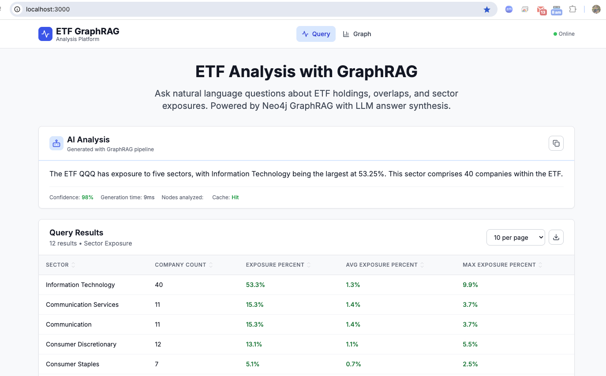

# ETF GraphRAG Analysis Platform

ETF composition and overlap analysis using Neo4j GraphRAG, FastAPI, React, and Cytoscape.js with mandatory LLM answer synthesis.

## Overview

This project demonstrates how to use **Neo4j + GraphRAG** for ETF analysis by combining graph relationships with embeddings to deliver more explainable and precise results than vector-only RAG.  

- **Goal**: Explore ETF holdings, sector distributions and cross-holdings using a graph database.  
- **Core Graph Data Model**: Represent ETFs, companies, and sectors as nodes; relationships capture holdings and classifications.  
- **Graph RAG**: Graph structure is combined with semantic search to improve precision, trustworthiness, and explainability.  

## 7-Step RAG Pipeline  

1. **Text preprocessing** – clean and normalize user queries for consistent downstream handling.  
2. **Entity grounding** – map query terms to graph entities like ETFs, companies, and sectors.  
3. **Intent classification** – detect the user’s intent (e.g., top holdings, sector mix, overlap).  
4. **Parameter fulfillment** – validate and assemble data parameters required by the intent template.  
5. **Cypher execution** – run parameterized Cypher queries on the Neo4j graph.  
6. **LLM synthesis** – convert query results into clear, concise, natural language answers.  
7. **Response assembly** – package the answer, data table, and metadata into a unified payload.  

## UI Screenshot



## System Architecture

```
┌─────────────────┐    ┌──────────────────┐    ┌─────────────────┐
│   React UI      │    │   FastAPI        │    │   Neo4j         │
│   (Port 3000)   │◄──►│   (Port 8000)    │◄──►│   (Port 7687)   │
│                 │    │                  │    │                 │
│ • Query Form    │    │ • GraphRAG       │    │ • ETF Data      │
│ • Results Table │    │ • 7-Step Pipeline│    │ • Graph Schema  │
│ • Cytoscape.js  │    │ • LLM Synthesis  │    │ • Cypher Queries│
│ • Graph Controls│    │ • Security Layer │    │ • Constraints   │
└─────────────────┘    └──────────┬───────┘    └─────────────────┘
                                  │
                                  ▼
                       ┌─────────────────┐
                       │   Ollama LLM    │
                       │   (Port 11434)  │
                       │                 │
                       │ • mistral:inst  │
                       │ • Answer Synth  │
                       │ • Intent Class  │
                       └─────────────────┘
```

## Quick Start

Clone the repository and start the entire stack:

```bash
git clone <repository-url>
cd neo4j-graphrag-etf-analysis

# CPU-only deployment (default)
docker compose --profile cpu --profile init up -d

# OR GPU-accelerated deployment (if NVIDIA GPU available)
docker compose --profile gpu --profile init up -d
```

## Prerequisites

* Docker & Docker Compose (20.10+)
* 8GB+ RAM (for Neo4j + Ollama)
* Optional: NVIDIA GPU for faster LLM inference

## How to Access

| Service | URL | Description |
|---------|-----|-------------|
| UI (React) | http://localhost:3000 | Main interface with query form & graph |
| API (FastAPI) | http://localhost:8000 | GraphRAG API with automatic docs |
| API Docs | http://localhost:8000/docs | Interactive OpenAPI documentation |
| Neo4j Browser | http://localhost:7474 | Database browser (neo4j/password123) |
| Health Check | http://localhost:8000/health | System health status |

## Neo4j Graph Data Model

### Core Nodes
```cypher
(:ETF {ticker, name, expense_ratio, total_assets, description, created_at})
(:Company {symbol, name, market_cap, industry, last_updated}) 
(:Sector {name, classification, description})
```

### Core Relationships
```cypher
(:ETF)-[:HOLDS {weight, shares, value, last_updated}]->(:Company)
(:Company)-[:IN_SECTOR]->(:Sector)
```

### GraphRAG Nodes
```cypher
(:Intent {key, type, description, confidence_threshold})
(:Entity {id, type, symbol, name, description})
(:Term {text, norm})
(:DocChunk {id, type, title, content})
```

### GraphRAG Relationships
```cypher
(:Term)-[:ALIAS_OF {confidence}]->(:Entity)
(:Intent)-[:REQUIRES {param_name, entity_type}]->(:Entity)
(:Entity)-[:REFERS_TO]->(:ETF|:Company|:Sector)
```

### Source Data
* 6 ETFs: SPY, QQQ, IWM, IJH, IVE, IVW with real metadata
* 500+ Companies with real holdings data
* 11 Sectors: Technology, Financials, Health Care, Consumer Discretionary, etc.
* GraphRAG: 7 intents, 50+ entities, 100+ terms, 5 docchunks

## Neo4j Queries

### ETF Holdings Analysis
```cypher
// Get top 10 holdings for SPY
MATCH (e:ETF {ticker: 'SPY'})-[h:HOLDS]->(c:Company)
RETURN e.ticker, c.symbol, c.name, 
       round(h.weight * 100, 2) as weight_percent
ORDER BY h.weight DESC
LIMIT 10;

// Find ETF exposure to specific company
MATCH (e:ETF {ticker: $ticker})-[h:HOLDS]->(c:Company {symbol: $symbol})
RETURN e.ticker as etf_ticker, e.name as etf_name,
       c.symbol, c.name as company_name, 
       round(h.weight * 100, 3) as exposure_percent;
```

### ETF Overlap Analysis
```cypher
// Calculate overlap between two ETFs
MATCH (e1:ETF {ticker: $etf1})-[h1:HOLDS]->(c:Company)<-[h2:HOLDS]-(e2:ETF {ticker: $etf2})
RETURN c.symbol, c.name,
       round(h1.weight * 100, 2) as percent_etf1,
       round(h2.weight * 100, 2) as percent_etf2,
       round((h1.weight + h2.weight) * 100, 2) as combined_percent,
       round(abs(h1.weight - h2.weight) * 100, 2) as difference_percent
ORDER BY (h1.weight + h2.weight) DESC
LIMIT 50;
```

### Sector Analysis
```cypher
// Get sector distribution for an ETF
MATCH (e:ETF {ticker: $ticker})-[h:HOLDS]->(c:Company)-[:IN_SECTOR]->(s:Sector)
RETURN s.name as sector_name,
       count(c) as company_count,
       round(sum(h.weight) * 100, 2) as sector_weight_percent,
       collect(c.symbol)[0..5] as sample_companies
ORDER BY sum(h.weight) DESC;

// Find companies by sector in ETF
MATCH (e:ETF {ticker: $ticker})-[h:HOLDS]->(c:Company)-[:IN_SECTOR]->(s:Sector {name: $sector})
RETURN c.symbol, c.name, round(h.weight * 100, 3) as weight_percent
ORDER BY h.weight DESC
LIMIT 20;
```

### GraphRAG Entity Queries
```cypher
// Find entities and their aliases
MATCH (t:Term)-[:ALIAS_OF]->(e:Entity)
RETURN e.type, e.symbol, e.name, collect(t.text) as aliases
ORDER BY e.type, e.symbol;

// Get available intents and their requirements
MATCH (i:Intent)-[:REQUIRES]->(e:Entity)
RETURN i.key as intent, i.description,
       collect(e.type) as required_entity_types
ORDER BY i.key;
```

## Tech Stack

| Layer | Technology | Purpose |
|-------|------------|---------|
| Frontend | React 18 + Vite + Tailwind CSS | Modern UI with fast builds |
| Visualization | Cytoscape.js | Interactive graph rendering |
| Backend | FastAPI + Pydantic | Type-safe API with auto docs |
| Database | Neo4j Community 5.15 + APOC | Graph database with procedures |
| GraphRAG | Custom pipeline | 7-step query processing |
| LLM | Ollama + Mistral Instruct | Local language model inference |
| Containerization | Docker + Docker Compose | Full-stack orchestration |
| Testing | Pytest + Vitest + React Testing Library | Comprehensive test coverage |
| HTTP Client | Axios | API communication with interceptors |
| Validation | Pydantic + JSON Schema | Input validation and serialization |